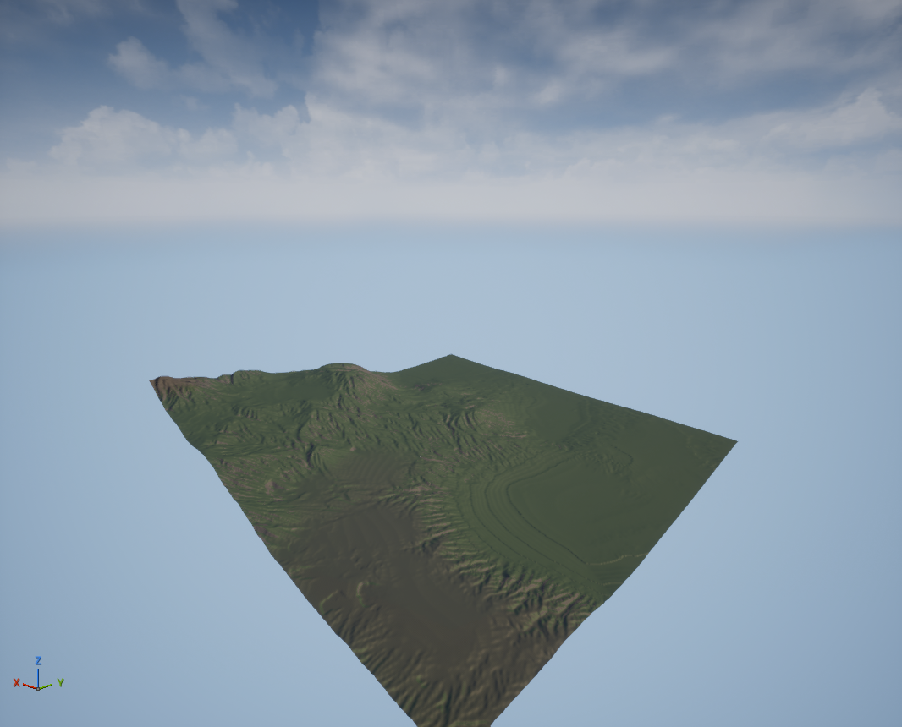
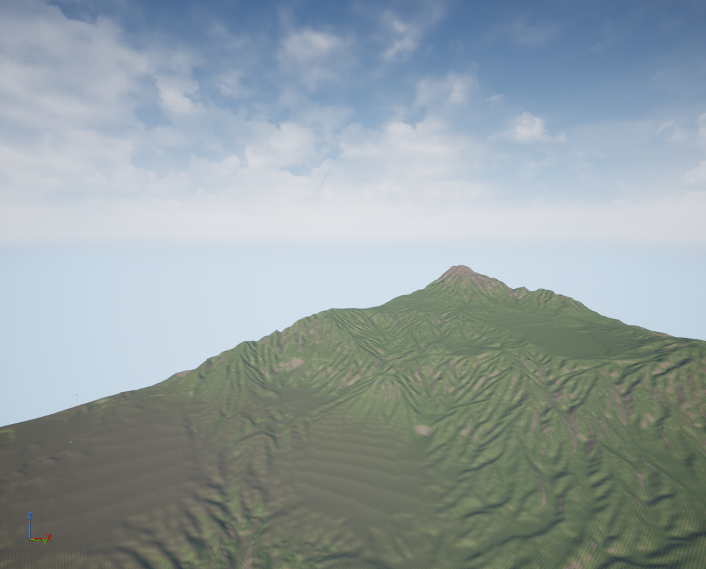
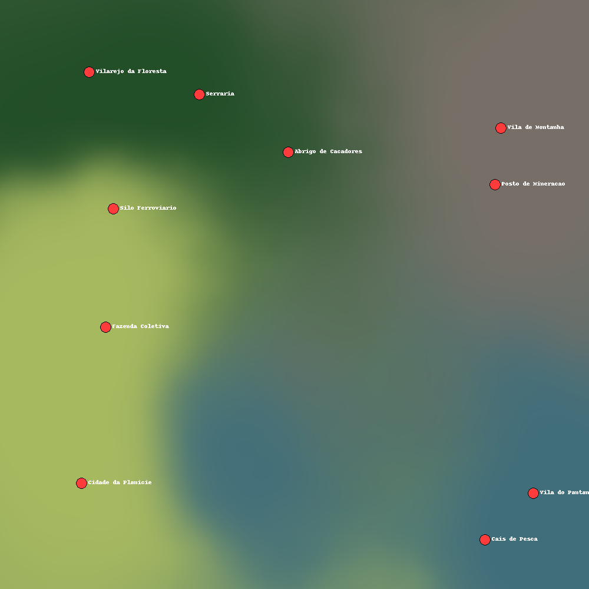

# Terreno AAA na Unreal Engine 5.8 controlado por IA via MCP

Geração procedural de um mapa de mundo aberto (1270 m × 1270 m, 4 biomas) na
Unreal Engine 5.8, controlada por IA através do **MCP nativo da Epic**
(plugin `ModelContextProtocol`), sem abrir a interface do editor.



---

## O que este projeto faz

- Gera terreno com **simulação de erosão hidráulica** (não é só ruído)
- Divide o mapa em **4 biomas com fronteiras orgânicas**
- **Pinta o material** proceduralmente por inclinação e altitude
- Reserva **10 sítios aplainados** para cidades e vilarejos
- Aplica tudo no engine via **Python + MCP**, sem cliques na UI
- Captura vistas de verificação por câmeras posicionadas por código

---

## Resultado

| Montanha vista da planície | Mapa de biomas |
|---|---|
|  |  |

| Bioma | Posição | Altitude | Assentamentos |
|---|---|---|---|
| Montanha | NE | até 235 m | Vila de Montanha, Posto de Mineração |
| Floresta | NO | ~105 m | Vilarejo da Floresta, Serraria, Abrigo de Caçadores |
| Planície | SO | ~42 m | Cidade da Planície, Fazenda Coletiva, Silo Ferroviário |
| Pântano | SE | ~15 m | Vila do Pântano, Cais de Pesca |

---

## Documentação

| Documento | Conteúdo |
|---|---|
| [docs/DIARIO.md](docs/DIARIO.md) | Passo a passo cronológico, incluindo o que foi descartado |
| [docs/ERROS_E_ARMADILHAS.md](docs/ERROS_E_ARMADILHAS.md) | **15 erros documentados** — sintoma, causa e solução |
| [docs/PIPELINE.md](docs/PIPELINE.md) | Arquitetura, fórmulas e como reproduzir |

Vale ler os erros antes de mexer: vários são não-óbvios e custaram horas
(erosão calibrada em espaço normalizado, crash ao digitar no console, etc.).

---

## Estrutura

```
scripts/
  gen/
    gen_v2.py                        gerador principal (erosão + biomas + weightmaps)
    gen_v1_dem.py                    histórico: heightmap de DEM real (Boêmia)
    ref_terrain_erosion_3_ways/      referência da comunidade (dandrino)
  ue/
    build_map.py                     cria o mapa a partir do template do pack
    apply_v2.py                      aplica altura + weightmaps
    apply_v3.py                      rebalanceia material, remove splines
    inspect_api.py                   mapeia a API de Landscape exposta ao Python
  mcp/
    mcp.py                           cliente MCP mínimo (HTTP/JSON-RPC)
    shoot3.py                        limpeza + captura das vistas
Heightmaps/                          heightmap e weightmaps gerados
docs/                                documentação e imagens
```

---

## Requisitos

- Unreal Engine 5.8 (Linux)
- Plugins: `ModelContextProtocol`, `AllToolsets`, `ToolsetRegistry`,
  `PythonScriptPlugin`, `EditorScriptingUtilities`
- Python local: `numpy`, `scipy`, `pillow`

---

## Como rodar

```bash
# 1. gerar o terreno (local, ~90s)
python3 scripts/gen/gen_v2.py

# 2. criar o mapa base (headless)
UnrealEditor-Cmd MCPTest.uproject \
  -run=pythonscript -script=$PWD/scripts/ue/build_map.py -unattended -nosplash

# 3. aplicar altura + material (precisa de RHI → editor GUI)
DISPLAY=:0 UnrealEditor MCPTest.uproject \
  -ExecCmds="ModelContextProtocol.StartServer 8000, py $PWD/scripts/ue/apply_v2.py"

# 4. capturar as vistas (editor aberto)
python3 scripts/mcp/shoot3.py
```

> **Nunca** execute Python digitando `py <script>` no console do editor:
> derruba a engine em UE 5.8. Sempre por `-ExecCmds` ou commandlet.
> Detalhes em [ERROS_E_ARMADILHAS.md](docs/ERROS_E_ARMADILHAS.md#1-crash-digitar-no-console-do-editor-derruba-a-engine).

---

## Assets de terceiros

O diretório `Content/` **não está versionado** (ver `.gitignore`). Ele contém o
pack **European Forest** da [Leartes Studios](https://leartesstudios.gumroad.com),
adquirido sob *Studio License*, que **proíbe redistribuição**.

O projeto usa do pack:
- o material de landscape `Landscape_01` e seus 4 `LayerInfo`
- o mapa `Demo` como template (iluminação + Landscape configurado)
- meshes de vegetação (Fir, Scots Pine, Birch, gramíneas, samambaias)

Quem clonar precisa importar o pack (ou substituir por outro material de
landscape com 4 camadas e ajustar os nomes em `apply_v2.py`).

---

## Créditos

- Erosão hidráulica: [dandrino/terrain-erosion-3-ways](https://github.com/dandrino/terrain-erosion-3-ways)
- Referência geográfica do Chernarus: [longcreek.me/blog/2021/chernarus-irl](https://longcreek.me/blog/2021/chernarus-irl)
- Dados de elevação (v1): [Mapzen/AWS Terrain Tiles](https://registry.opendata.aws/terrain-tiles/)

---

## Próximos passos

- [ ] Vegetação por bioma via PCG (a do pack foi removida por estar nas
      posições do terreno antigo)
- [ ] Construções nos 10 sítios aplainados
- [ ] Rio/lago com o sistema de água (o escoamento da erosão já está calculado)
- [ ] Estradas ligando os assentamentos via Landscape Splines
